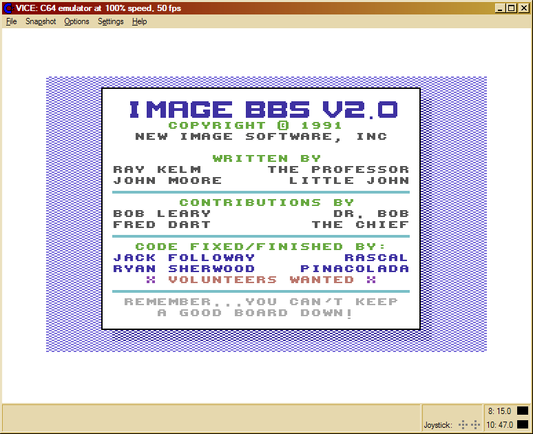

**Image BBS**

This program is a very nice bulletin board system.

Here is [programming information for v1.2](http://cbbsoutpost.servebbs.com/dragonseye/projects/imageprg-index.html).

Some complain it is complicated. Others say it's too slow. I agree. When Jack "Rascal" Followay gave me the source code for v2.0, my mind went in a million directions...

**Screenshots**

Here is the original boot splash screen. It gets the point across, but it's rather dull:

[![[ Boot splash screen ]](image-2.0-0001-bootsplash.gif)](image-2.0-0001-bootsplash.gif)

This is my reworked version. A bit more colorful and informative (okay, it's an ego boost too...):

More pictures of the boot process (yes, the date is not Y2K-fixed):

[![[ Initializing ]](image-2.0-0002-initialization.gif)](image-2.0-0003-blocks-free.gif)  

_Initializing the BBS._

Some explanation:

-   The status line at the bottom of the screen continues to flash until the time is set, either through an LTK HD's clock port, CMD real-time clock, or manually entering it at system idle. Once the time is set, location 1010 is POKEd with a non-zero value to stop the flashing.
    
-   I have written a BASIC program (which should be integrated into the IM system later), adding two new options:
    
    -   setting it via the last AutoMaintenance timestamp (saved to record #37 of e.data)
        
    -   (This has yet to be added) waiting for user input, timing out after five minutes if no entry is made and falling back to the saved AM timestamp. The same time entry routine used at system idle would be good to use if it were renumbered.
        
-   ECS (extended command set) definitions are more featureful this release, but the file structure is not compatible with 1.2's ml.ecsdefs file.
    
-   Print mode definitions are broken. I know the range of memory they load in, but not the format. ml.printmodes is not compatible.
    
-   Lightbar definitions: You can define the text of the lightbar in the file e.lightbar,p, and that is read in here. There are 8 pages in this version, vs. Image 1.2's 2 pages ([lightbar info](http://cbbsoutpost.servebbs.com/dragonseye/projects/lightbar.html)).
    
-   Alarm tables let the sysop trigger events at particular times; for example, if they wanted to close the UD's at 10:00 PM, they could create an event to toggle off the UDs check mark on the lightbar.
    
-   Network alarm tables are a mystery at the moment.
    
-   The same goes for function key definitions (not shown). e.fkeys,s is read, using 8 definition lines in the file, with the back-arrow serving as a RETURN character. I can find no mention of how to access this functionality; I suspect the screen mask must be toggled off (as it is below) first to use them.
    

[![[ Blocks free ]](image-2.0-0003-blocks-free.gif)](image-2.0-0003-blocks-free.gif)  

_Blocks free are shown._

_[![[ System idle ]](image-2.0-0004-system-idle.gif)](image-2.0-0004-system-idle.gif)_  

_System idle._

> From the top left-hand corner, working our way down:

-   Clock
    
-   Number of feedback messages, sysop mail, calls in the current system log, and new users
    
-   Below that is the last ten users to have called the system
    
-   Page 1 of the lightbar
    
-   Entering the system status area, we've got:
    
    -   The last user on the system (notice how handles are not all uppercase anymore!)
        
    -   When they logged off
        
    -   The date and time the last log was created
        
    -   The system **R**eservation **P**ass**W**ord (WHEELMAN, something I made up); similar to Image v1.2, you can reserve the system for **O**ne call, **A**ll calls, or **N**one (this shows up in the **Resv** area; selecting None doesn't seem to erase the password from the display area... there's a slight bug in the display routine).
        
    -   Next up is the area (System Idle, of course)
        
    -   The System and Network reservation status is displayed.
        
-   Baud rate (I'd really like to change that to _BPS_ rate) is displayed (0 for no connection)
    
-   **User:** I think this is similar to the **UR:** status item in 1.2, which listed the highest account number. Not 100% sure.
    
-   In the white status area, we have some more information:
    
    -   **C=** (callers to system)
        
    -   **N=** (new users today)
        
    -   **U=** (percentage of system used)
        
    -   **I=** (percentage of system idle)
        
    -   The sixteen-character information window (moved from v1.2; it used to be where **M=** and **L=** are now)
        
-   Below that:
    
    -   The receive window, **M=** (memory free, there's 5K more at system idle as compared to Image 1.2!), L= (line number being executed, if trace mode is on; this used to obscure part of the transmit window when toggled on), and the transmit window
        
    -   Finally, the system date and time, a small status area which can display **P**ause, **G**arbage collect, or **A**bort indicators, and the idle timer.
        
    -   Two checkmarks (not shown, on the left and right sides of the bottom line) indicate Commodore Color/Graphics mode and carrier detect status, respectively.
        

----------

Here's our chance to improve the speed and user experience. How?

2.  **Structures.** These areas of memory replace the string and numeric arrays used in v1.2(a). They can be loaded from disk, searched, compared, and inserted and deleted from—all at machine language speed. No more slow BASIC loops! I just need Jack's programming reference guide...
    
3.  **Graphic menu system.** Those who dislike the "command line" aspect of Image may use a simple, quick cursor-controlled system instead.
    
    -   The caller's terminal cursor highlights the currently selected item instead of moving an entire highlight bar.
        
    -   They may also simply type the menu option key—multiple keypresses are supported, like /Q or R3 for example—to select the relevant choice. This is demonstrated below in a screenshot of the IM system, Image 2.0's built-in configuration system:
        
    
    [![[ IM configuration editor ]](image-2.0-0005-configuration-editor.gif)](image-2.0-0005-configuration-editor.gif)
    
    > (Items marked with a * are either incomplete or missing.)
    
4.  **Built-in 19,200kBPS operation.** This eliminates complex hacks to the base install which were common in the "bad old days" of running Image 1.2(a).
    
    _This page was last updated 8/12/2007 (MM/DD/YYYY)._
